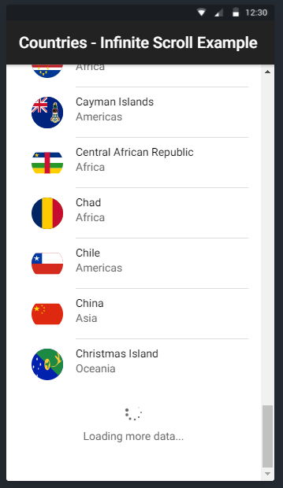

## IONIC Infinite Scroller (Android % iOS)

This is a simple application developed using IONIC ANGULAR.

## Table of Contents
 - [Description](#description)
 - [Getting Started](#getting-started)
 - [App Preview](#app-preview) 

## Description

Have created this application to demonstrate how to use IONIC Infinite Scroll. This application loads all the Countries with there flag.

## Getting Started

* Clone this repository: `git clone https://github.com/thanveerahamed/ionic-infinite-scroll`.
* Run `npm install` from the project root.
* Install the ionic CLI (`npm install -g ionic`)
* Run `ionic serve` in a terminal from the project root.
* Cheers!!

## App Preview

All app preview screenshots were taken by running `ionic serve --lab` on Chrome Browser.

- Home Page

  
